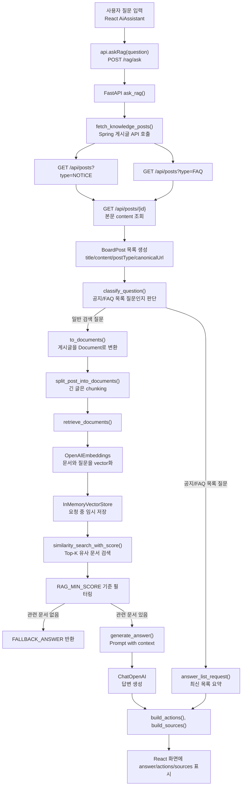
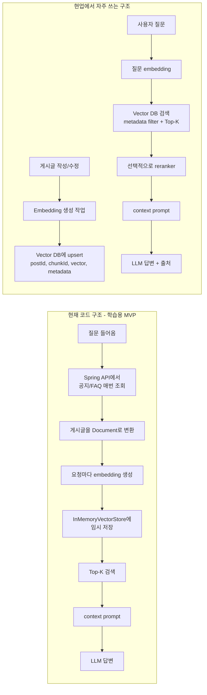

# FastAPI RAG + 게시판 AI 비서 학습 총정리

## 0. 먼저 보는 전체 구조 도식

처음 볼 때 가장 중요한 기준은 이것이다.

```text
현재 코드에서는 벡터를 DB에 영구 저장하지 않는다.
질문이 들어올 때마다 게시글을 가져오고,
그 게시글을 임시로 embedding해서 InMemoryVectorStore에 넣은 뒤 검색한다.
```

즉 현재 구현은 "학습용 MVP"에 가깝다.

### 0-1. 현재 프로젝트의 RAG 흐름



이 도식을 코드 흐름으로 줄이면 다음과 같다.

```text
React 질문
-> FastAPI /rag/ask
-> Spring에서 NOTICE/FAQ 조회
-> title/content를 Document로 변환
-> Embedding
-> InMemoryVectorStore에 임시 저장
-> 유사도 검색 Top-K
-> 검색 점수 낮으면 fallback
-> 검색 결과를 context로 넣고 LLM 답변 생성
-> answer/actions/sources 반환
```

### 0-2. 현재 구조와 현업 구조 비교



비교 표로 보면 더 명확하다.

| 구분 | 현재 코드 | 현업에서 많이 쓰는 구조 |
|---|---|---|
| 게시글 저장 | Spring + PostgreSQL | Spring + PostgreSQL |
| embedding 생성 시점 | 질문이 들어올 때마다 생성 | 게시글 작성/수정 시 미리 생성 |
| vector 저장 위치 | `InMemoryVectorStore` | Vector DB 또는 pgvector |
| vector 유지 기간 | 요청 처리 중에만 존재 | DB에 영구 저장 |
| 검색 방식 | LangChain 임시 vector store 검색 | Vector DB에서 Top-K 검색 |
| 성능 | 게시글 적을 때 학습용으로 적합 | 게시글 많아도 확장 가능 |
| 구현 난이도 | 낮음 | 중간 이상 |
| 현재 개선 포인트 | embedding 재계산 제거 | sync/upsert/삭제 전략 필요 |

### 0-3. 현재 코드에서 "벡터 저장"은 어디서 일어나는가

현재 코드에서 가장 헷갈리기 쉬운 부분이다.

```python
def retrieve_documents(question: str, documents: list[Document]) -> list[tuple[Document, float]]:
    embeddings = OpenAIEmbeddings(model=OPENAI_EMBEDDING_MODEL)
    vector_store = InMemoryVectorStore(embeddings)
    vector_store.add_documents(documents)
    return vector_store.similarity_search_with_score(question, k=min(RAG_TOP_K, len(documents)))
```

여기서 핵심은 이 줄이다.

```python
vector_store.add_documents(documents)
```

이 줄에서 LangChain이 각 `Document.page_content`를 embedding하고, 그 결과 vector를 `InMemoryVectorStore`에 넣는다.

하지만 이름 그대로 `InMemory`다.

```text
메모리에 잠깐 저장한다.
DB에 저장하지 않는다.
서버 재시작 후 유지되지 않는다.
요청이 끝나면 재사용하기 어렵다.
```

그래서 현재 구조를 정확히 말하면 다음이다.

```text
게시글 vector를 영구 저장한 RAG가 아니라,
요청마다 임시 vector store를 만들어 검색하는 RAG MVP다.
```

### 0-4. 메소드 기준으로 보는 공부 순서

처음 공부할 때는 파일 전체를 위에서 아래로 읽기보다, 아래 메소드 흐름으로 보면 좋다.

```text
1. React 입력
   App.tsx -> AiAssistant -> handleSubmit()

2. FastAPI 호출
   api.ts -> askRag() -> ragFetch()

3. RAG 입구
   main.py -> ask_rag()

4. 게시글 가져오기
   fetch_knowledge_posts()
   fetch_post_summaries()
   fetch_post_detail()

5. 게시글을 검색 문서로 변환
   to_documents()
   split_post_into_documents()
   split_long_text()

6. 질문 종류 분기
   classify_question()
   answer_list_request()

7. embedding + vector 검색
   retrieve_documents()

8. 검색 결과가 약한지 판단
   RAG_MIN_SCORE
   FALLBACK_ANSWER

9. context prompt 생성
   generate_answer()
   generate_list_answer()

10. 화면에 보여줄 링크 정리
    build_actions()
    build_sources()
    normalize_path()
```

이 순서로 보면 "어떤 라이브러리를 썼는지"보다 "데이터가 어떻게 흐르는지"가 먼저 보인다.

### 0-5. 이 프로젝트에서 개선하면 좋은 방향

현재 구조를 현업형 구조로 바꾼다면 핵심 개선은 다음이다.

```text
1. 게시글 작성/수정 시점에 embedding을 생성한다.
2. embedding vector를 별도 테이블이나 Vector DB에 저장한다.
3. 질문이 들어오면 게시글을 다시 embedding하지 않는다.
4. 질문만 embedding한 뒤 저장된 vector들과 유사도 검색한다.
5. 검색 결과 postId/chunkId로 원본 게시글을 찾아 context를 만든다.
6. 답변에는 반드시 sources를 함께 반환한다.
```

현재 코드에서 바로 개선 후보가 되는 부분은 `retrieve_documents()`다.

현재:

```text
요청마다 OpenAIEmbeddings 생성
요청마다 InMemoryVectorStore 생성
요청마다 모든 Document add
요청마다 유사도 검색
```

개선:

```text
게시글 저장/수정 시 embedding 생성
Vector DB에 저장
질문 시 질문 embedding만 생성
Vector DB에서 Top-K 검색
```

이 차이를 이해하면 이후 Vector DB, LangChain, pgvector, Chroma 같은 기술을 공부할 때 기준이 생긴다.

## 1. 이 기능을 한 문장으로 설명하면

게시판에 저장된 공지사항과 FAQ를 AI가 먼저 검색한 뒤, 검색된 게시글 내용을 근거로 사용자 질문에 답변하는 AI 비서 기능이다.

중요한 점은 LLM이 아무 근거 없이 답하는 구조가 아니라는 것이다.

```text
사용자 질문
-> 게시판 공지/FAQ 검색
-> 관련 게시글을 context로 구성
-> LLM이 context를 보고 답변
-> 출처 링크와 함께 반환
```

이 구조를 RAG라고 부른다.

RAG는 Retrieval-Augmented Generation의 줄임말이다.

쉽게 말하면:

```text
Retrieval = 관련 자료를 먼저 찾기
Generation = 찾은 자료를 바탕으로 답변 생성하기
```

## 2. 왜 RAG를 사용했는가

LLM은 우리 게시판 DB 내용을 원래 알지 못한다.

예를 들어 사용자가 "비밀번호는 어디서 바꿔?"라고 물어도, LLM은 프로젝트의 실제 메뉴나 게시글 내용을 모른다.

그래서 먼저 게시판의 공지/FAQ 글을 가져오고, 그중 질문과 관련 있는 글을 찾아서 LLM에게 같이 전달한다.

이렇게 하면 답변이 프로젝트 내부 데이터에 근거하게 된다.

## 3. 전체 구조

현재 구현은 Spring 내부에 AI 기능을 넣지 않고, FastAPI 서버를 따로 둔 구조다.

```text
React Frontend
  - 사용자가 AI 비서에 질문 입력
  - FastAPI /rag/ask 호출

FastAPI RAG Server
  - Spring 게시글 API 호출
  - NOTICE, FAQ 게시글 수집
  - 게시글을 Document로 변환
  - Embedding + Vector Store 검색
  - LLM 답변 생성

Spring Boot Backend
  - 게시글 저장/조회
  - 공지/FAQ 원본 데이터 제공

PostgreSQL
  - 게시글, 회원, 태그 등 실제 데이터 저장
```

역할을 나누면 이렇게 볼 수 있다.

```text
Spring = 원본 데이터 관리자
FastAPI = AI 검색/답변 담당
React = 사용자 질문 UI
```

## 4. 현재 코드에서 봐야 할 주요 파일

### FastAPI RAG 서버

```text
게시판/rag-server/main.py
```

AI 비서의 핵심 로직이 들어 있다.

여기에서 게시글 조회, Document 변환, chunking, embedding 검색, prompt 생성, fallback 처리를 한다.

### FastAPI 의존성

```text
게시판/rag-server/requirements.txt
```

사용한 Python 라이브러리가 정리되어 있다.

### FastAPI 환경 변수

```text
게시판/rag-server/.env.example
```

OpenAI API Key, Spring API 주소, 검색 점수 기준, chunk 크기 등을 설정한다.

### Spring 게시글 도메인

```text
게시판/backend/src/main/java/com/example/board/post/Post.java
게시판/backend/src/main/java/com/example/board/post/PostService.java
게시판/backend/src/main/java/com/example/board/post/PostController.java
게시판/backend/src/main/java/com/example/board/post/PostRepository.java
```

게시글 저장, 조회, 목록 검색을 담당한다.

### React AI 비서 UI

```text
게시판/front/src/App.tsx
게시판/front/src/lib/api.ts
게시판/front/src/types.ts
게시판/front/src/styles.css
```

AI 비서 버튼, 질문 입력, FastAPI 호출, 답변/출처 표시를 담당한다.

## 5. 사용한 라이브러리와 역할

### fastapi

Python으로 API 서버를 만들기 위한 라이브러리다.

현재 코드에서는 다음 API를 만든다.

```text
GET /health
POST /rag/ask
```

### uvicorn

FastAPI 서버를 실행하는 ASGI 서버다.

실행 예시는 다음과 같다.

```powershell
uvicorn main:app --reload --port 8000
```

### python-dotenv

`.env` 파일의 환경 변수를 Python 코드에서 읽기 위해 사용한다.

현재 코드에서는 다음처럼 사용한다.

```python
load_dotenv()
```

### httpx

FastAPI 서버에서 Spring Boot API를 호출할 때 사용한다.

현재 코드는 `httpx.AsyncClient`를 사용해 비동기 HTTP 요청을 보낸다.

### langchain

RAG 구현을 쉽게 하기 위해 사용한다.

현재 코드에서는 `Document`, `InMemoryVectorStore`, `SystemMessage`, `HumanMessage`를 사용한다.

### langchain-openai

OpenAI 모델과 LangChain을 연결하기 위해 사용한다.

현재 코드에서는 두 가지를 사용한다.

```text
OpenAIEmbeddings = 문장을 embedding vector로 변환
ChatOpenAI = context를 보고 답변 생성
```

### pydantic

FastAPI 요청/응답 데이터 구조를 정의하고 검증하기 위해 사용한다.

예를 들어 질문은 1자 이상 500자 이하로 제한한다.

```python
class RagAskRequest(BaseModel):
    question: str = Field(..., min_length=1, max_length=500)
```

## 6. 전체 요청 흐름

사용자가 AI 비서에 질문을 입력하면 다음 순서로 동작한다.

```text
1. React AI 비서 UI에서 질문 입력
2. React가 FastAPI POST /rag/ask 호출
3. FastAPI가 질문 문자열을 정리
4. FastAPI가 Spring API에서 NOTICE, FAQ 게시글 조회
5. 목록 응답에는 본문이 부족하므로 각 게시글 상세 API를 다시 호출
6. 게시글 title/content를 LangChain Document로 변환
7. 질문 의도를 먼저 분류
8. 공지/FAQ 목록 질문이면 목록 요약 흐름으로 처리
9. 일반 질문이면 embedding 기반 유사도 검색 흐름으로 처리
10. 관련 게시글을 context로 묶음
11. ChatOpenAI에 context와 question을 전달
12. 답변, 액션 링크, 출처를 React로 반환
13. React가 화면에 답변과 출처 링크 표시
```

## 7. React에서 FastAPI를 호출하는 흐름

React의 AI 비서는 `App.tsx` 안에 있다.

핵심 상태는 다음과 같다.

```tsx
const [open, setOpen] = useState(false);
const [question, setQuestion] = useState("");
const [result, setResult] = useState<RagAskResponse | null>(null);
const [error, setError] = useState("");
const [loading, setLoading] = useState(false);
```

의미는 다음과 같다.

```text
open = AI 비서 패널 열림 여부
question = 사용자가 입력한 질문
result = FastAPI에서 받은 답변 결과
error = 요청 실패 메시지
loading = 답변을 기다리는 중인지 여부
```

질문을 전송하는 핵심 코드는 다음이다.

```tsx
setResult(await api.askRag(nextQuestion));
```

이 줄이 React와 FastAPI를 연결한다.

`api.askRag()`는 `front/src/lib/api.ts`에 있다.

```ts
askRag: (question: string) =>
  ragFetch<RagAskResponse>("/rag/ask", { method: "POST", body: { question } }),
```

즉 React는 다음 요청을 보낸다.

```http
POST http://localhost:8000/rag/ask
Content-Type: application/json

{
  "question": "비밀번호는 어디서 바꿔?"
}
```

응답 타입은 `front/src/types.ts`에 정의되어 있다.

```ts
export interface RagAskResponse {
  answer: string;
  actions: RagAction[];
  sources: RagSource[];
}
```

화면에는 세 가지가 표시된다.

```text
answer = AI 답변
actions = 바로 이동할 수 있는 기능 링크
sources = 답변 근거 게시글
```

## 8. Spring은 어떤 역할을 하는가

Spring은 AI 로직을 직접 처리하지 않는다.

Spring은 게시글의 원본 데이터를 관리한다.

게시글 엔티티는 `Post.java`에 있다.

중요 필드는 다음과 같다.

```java
private String title;
private String content;
private PostType postType;
private String canonicalUrl;
```

RAG 입장에서 중요한 값은 `title`, `content`, `postType`, `canonicalUrl`이다.

```text
title = 검색 대상 제목
content = 검색 대상 본문
postType = NOTICE, FAQ 구분
canonicalUrl = 답변 후 이동시킬 기능 경로
```

게시글 목록 API는 `PostController`에서 제공한다.

```java
@GetMapping
public ApiResponse<PageResponse<PostListResponse>> list(...)
```

게시글 상세 API는 다음이다.

```java
@GetMapping("/{id}")
public ApiResponse<PostDetailResponse> detail(@PathVariable Long id)
```

FastAPI는 이 두 API를 사용한다.

```text
GET /api/posts?type=NOTICE&page=1&size=100
GET /api/posts?type=FAQ&page=1&size=100
GET /api/posts/{id}
```

목록 API만으로는 본문이 부족할 수 있으므로, FastAPI가 각 게시글 id로 상세 API를 다시 호출한다.

## 9. FastAPI 앱 생성과 CORS 설정

FastAPI 서버는 `main.py`에서 생성한다.

```python
app = FastAPI(title="Board RAG Assistant", version="0.1.0")
```

React 개발 서버가 FastAPI를 호출할 수 있도록 CORS도 설정한다.

```python
app.add_middleware(
    CORSMiddleware,
    allow_origins=ALLOWED_ORIGINS,
    allow_credentials=True,
    allow_methods=["*"],
    allow_headers=["*"],
)
```

기본 허용 출처는 다음이다.

```text
http://localhost:5173
```

즉 Vite React 개발 서버에서 FastAPI를 호출할 수 있다.

## 10. FastAPI 요청/응답 모델

요청 모델은 다음이다.

```python
class RagAskRequest(BaseModel):
    question: str = Field(..., min_length=1, max_length=500)
```

의미:

```text
question은 필수
최소 1자
최대 500자
```

응답 모델은 다음이다.

```python
class RagAskResponse(BaseModel):
    answer: str
    actions: list[ActionResponse]
    sources: list[SourceResponse]
```

의미:

```text
answer = AI가 생성한 답변
actions = 사용자가 바로 이동할 수 있는 링크
sources = 답변에 사용된 게시글 출처
```

출처 모델은 다음이다.

```python
class SourceResponse(BaseModel):
    title: str
    sourceUrl: str
    score: float
```

점수는 유사도 검색 결과를 보여주기 위한 값이다.

## 11. 핵심 엔드포인트: POST /rag/ask

가장 중요한 함수는 `ask_rag()`다.

```python
@app.post("/rag/ask", response_model=RagAskResponse)
async def ask_rag(request: RagAskRequest) -> RagAskResponse:
```

이 함수가 전체 RAG 흐름의 입구다.

큰 흐름은 다음과 같다.

```text
1. 질문 정리
2. 게시글 가져오기
3. 질문 의도 분류
4. 목록 질문이면 목록 요약 처리
5. 일반 질문이면 Document 변환
6. embedding 검색
7. 관련도 낮으면 fallback
8. 답변 생성
9. actions/sources 생성
10. 응답 반환
```

질문 정리:

```python
question = request.question.strip()
if not question:
    raise HTTPException(status_code=400, detail="question is required.")
```

앞뒤 공백을 제거하고, 비어 있으면 400 에러를 반환한다.

게시글 가져오기:

```python
posts = await fetch_knowledge_posts()
if not posts:
    return RagAskResponse(answer=FALLBACK_ANSWER, actions=[], sources=[])
```

게시글이 없으면 답변을 만들지 않는다.

## 12. Spring API에서 공지/FAQ 가져오기

FastAPI가 Spring API를 호출하는 함수는 `fetch_knowledge_posts()`다.

```python
async def fetch_knowledge_posts() -> list[BoardPost]:
    posts: list[BoardPost] = []
    async with httpx.AsyncClient(timeout=10.0) as client:
        for post_type in ("NOTICE", "FAQ"):
            summaries = await fetch_post_summaries(client, post_type)
            for summary in summaries:
                detail = await fetch_post_detail(client, summary["id"])
                posts.append(...)
    return posts
```

중요한 점:

```text
검색 대상은 NOTICE와 FAQ만이다.
GENERAL, QUESTION 게시글은 RAG 지식으로 쓰지 않는다.
```

목록 조회:

```python
response = await client.get(
    f"{BOARD_API_BASE_URL}/posts",
    params={"type": post_type, "page": 1, "size": 100},
)
```

상세 조회:

```python
response = await client.get(f"{BOARD_API_BASE_URL}/posts/{post_id}")
```

왜 상세 조회를 다시 하느냐면, 목록 응답에는 본문이 충분하지 않을 수 있기 때문이다.

RAG는 본문 내용이 중요하므로 상세 API에서 `content`를 가져온다.

## 13. Embedding과 Vector

Embedding은 문장을 숫자 배열로 바꾸는 작업이다.

예를 들어:

```text
"비밀번호 변경 방법"
-> [0.12, -0.44, 0.83, ...]
```

이 숫자 배열을 Vector라고 부른다.

컴퓨터는 문장의 의미를 직접 비교하기 어렵기 때문에, 문장을 vector로 바꿔서 비교한다.

현재 코드에서 embedding 모델을 준비하는 부분은 다음이다.

```python
embeddings = OpenAIEmbeddings(model=OPENAI_EMBEDDING_MODEL)
```

기본 embedding 모델은 `.env.example` 기준으로 다음이다.

```text
text-embedding-3-small
```

## 14. Document 변환

Spring에서 가져온 게시글은 바로 embedding하지 않고, LangChain `Document`로 바꾼다.

```python
def to_documents(posts: list[BoardPost]) -> list[Document]:
    documents: list[Document] = []
    for post in posts:
        documents.extend(split_post_into_documents(post))
    return documents
```

짧은 글은 게시글 1개를 Document 1개로 만든다.

```python
Document(page_content=f"{title}\n\n{content}", metadata=metadata)
```

`page_content`는 실제 검색 대상 텍스트다.

```text
제목

본문
```

`metadata`는 검색 결과를 다시 게시글로 연결하기 위한 정보다.

```python
metadata = {
    "id": post.id,
    "title": title,
    "sourceUrl": f"/posts/{post.id}",
    "postType": post.postType,
    "canonicalUrl": post.canonicalUrl,
}
```

metadata는 LLM이 답변을 만드는 직접 본문이라기보다, 출처 표시와 링크 생성에 사용된다.

## 15. Chunking

Chunking은 긴 글을 여러 조각으로 나누는 작업이다.

현재 코드는 본문이 800자를 넘으면 chunking을 적용한다.

```python
if len(content) <= RAG_CHUNK_THRESHOLD:
    return [Document(page_content=f"{title}\n\n{content}", metadata=metadata)]
```

800자 이하이면 그대로 하나의 Document로 만든다.

800자를 넘으면 문단 기준으로 나눈다.

```python
return [
    Document(page_content=f"{title}\n\n{chunk}", metadata={**metadata, "chunkIndex": index})
    for index, chunk in enumerate(split_long_text(content), start=1)
]
```

chunking을 하는 이유:

```text
긴 게시글 전체를 한 번에 검색하면 정확도가 떨어질 수 있다.
질문과 관련 있는 작은 부분만 검색되도록 나누는 것이 유리하다.
```

예를 들어 하나의 FAQ에 여러 주제가 섞여 있으면, 글 전체보다 관련 문단만 검색되는 편이 더 정확하다.

## 16. 질문 의도 분류

현재 코드는 질문을 바로 embedding 검색하지 않고, 먼저 간단한 의도 분류를 한다.

```python
def classify_question(question: str) -> str:
    normalized = question.lower()
    if any(keyword in normalized for keyword in ("공지", "공지사항", "안내")):
        return "NOTICE_LIST"
    if any(keyword in normalized for keyword in ("faq", "자주 묻는 질문", "질문 모음")):
        return "FAQ_LIST"
    return "SEARCH"
```

분류 결과는 세 가지다.

```text
NOTICE_LIST = 공지 목록을 묻는 질문
FAQ_LIST = FAQ 목록을 묻는 질문
SEARCH = 일반 검색 질문
```

예시:

```text
"공지사항 알려줘" -> NOTICE_LIST
"FAQ 뭐 있어?" -> FAQ_LIST
"비밀번호는 어디서 바꿔?" -> SEARCH
```

이렇게 분기한 이유는 "공지 알려줘" 같은 질문은 특정 문서 하나를 찾는 것보다 최신 공지 목록을 보여주는 것이 더 자연스럽기 때문이다.

## 17. 공지/FAQ 목록 질문 처리

목록 질문은 `answer_list_request()`에서 처리한다.

```python
def answer_list_request(question: str, posts: list[BoardPost], post_type: str) -> RagAskResponse:
```

최신 게시글 몇 개를 고른다.

```python
selected_posts = latest_posts(posts, post_type, RAG_LIST_LIMIT)
```

기본 개수는 `.env.example` 기준으로 5개다.

```text
RAG_LIST_LIMIT=5
```

그 다음 `generate_list_answer()`를 호출해 목록 요약 답변을 만든다.

```python
answer = generate_list_answer(question, post_type, selected_posts)
```

목록 질문은 유사도 검색 점수와 상관없이 선택된 공지/FAQ를 직접 context로 만든다.

## 18. 일반 질문 처리: Retrieval

일반 질문은 embedding 기반 검색을 사용한다.

핵심 함수는 `retrieve_documents()`다.

```python
def retrieve_documents(question: str, documents: list[Document]) -> list[tuple[Document, float]]:
    embeddings = OpenAIEmbeddings(model=OPENAI_EMBEDDING_MODEL)
    vector_store = InMemoryVectorStore(embeddings)
    vector_store.add_documents(documents)
    return vector_store.similarity_search_with_score(question, k=min(RAG_TOP_K, len(documents)))
```

이 함수 안에서 일어나는 일:

```text
1. OpenAI embedding 모델 준비
2. InMemoryVectorStore 생성
3. 게시글 Document들을 vector store에 추가
4. 사용자 질문과 비슷한 문서 Top-K개 검색
```

중요한 점:

```text
현재는 Vector DB를 쓰지 않는다.
질문이 들어올 때마다 임시 InMemoryVectorStore를 만든다.
```

즉 학습용 MVP로는 이해하기 쉽지만, 운영용으로는 비효율적일 수 있다.

## 19. Cosine Similarity

Cosine Similarity는 두 vector가 얼마나 비슷한 방향을 보는지 계산하는 알고리즘이다.

쉽게 말하면:

```text
질문 vector와 게시글 vector가 비슷한 방향이면 관련 있는 글
질문 vector와 게시글 vector가 다른 방향이면 관련 없는 글
```

현재 코드에 cosine similarity 공식이 직접 보이지는 않는다.

그 이유는 LangChain의 `InMemoryVectorStore`가 내부에서 유사도 검색을 처리하기 때문이다.

현재 코드에서는 이 한 줄로 유사도 검색을 한다.

```python
vector_store.similarity_search_with_score(question, k=min(RAG_TOP_K, len(documents)))
```

학습할 때는 직접 구현해보면 좋다.

```python
def cosine_similarity(a, b):
    dot = sum(x * y for x, y in zip(a, b))
    norm_a = sum(x * x for x in a) ** 0.5
    norm_b = sum(y * y for y in b) ** 0.5
    return dot / (norm_a * norm_b)
```

현재 프로젝트에서는 직접 구현하지 않고 LangChain에게 맡긴 상태다.

## 20. Top-K Retrieval

Top-K Retrieval은 관련도가 높은 문서 K개만 고르는 것이다.

현재 기본값은 `.env.example` 기준으로 3개다.

```text
RAG_TOP_K=3
```

코드에서는 다음처럼 사용한다.

```python
k=min(RAG_TOP_K, len(documents))
```

문서가 2개밖에 없는데 3개를 가져오려고 하면 안 되므로, 실제 문서 개수와 비교해서 작은 값을 사용한다.

예시:

```text
전체 문서 10개, RAG_TOP_K=3 -> 3개 검색
전체 문서 2개, RAG_TOP_K=3 -> 2개 검색
```

## 21. 검색 점수와 fallback

검색 결과가 있어도 점수가 너무 낮으면 답변하지 않는다.

```python
relevant = [(document, score) for document, score in retrieved if score >= RAG_MIN_SCORE]
if not relevant:
    return RagAskResponse(answer=FALLBACK_ANSWER, actions=[], sources=[])
```

기본 기준은 `.env.example` 기준으로 0.5다.

```text
RAG_MIN_SCORE=0.5
```

fallback 문구는 다음이다.

```python
FALLBACK_ANSWER = "관련 자료가 부족해서 정확히 답변할 수 없습니다."
```

fallback을 넣은 이유:

```text
검색된 근거가 약한데도 LLM이 그럴듯하게 답변하는 것을 막기 위해서다.
```

이게 RAG에서 매우 중요하다.

RAG의 목표는 무조건 답변하는 것이 아니라, 근거가 있을 때만 답변하는 것이다.

## 22. Prompt with context

검색된 문서는 `generate_answer()`에서 prompt에 들어간다.

```python
context = "\n\n".join(
    (
        f"[문서 {index}]\n"
        f"제목: {document.metadata['title']}\n"
        f"출처: {document.metadata['sourceUrl']}\n"
        f"내용:\n{document.page_content}"
    )
    for index, (document, _) in enumerate(retrieved, start=1)
)
```

이렇게 만들어진 context는 대략 이런 모양이다.

```text
[문서 1]
제목: Q. 비밀번호를 잊어버렸어요
출처: /posts/4
내용:
Q. 비밀번호를 잊어버렸어요

비밀번호를 잊으셨다면 로그인 화면 하단의 비밀번호 찾기 버튼을 이용해 주세요...
```

그리고 SystemMessage로 AI의 규칙을 정한다.

```python
SystemMessage(
    content=(
        "당신은 게시판 AI 비서입니다. "
        "반드시 제공된 context에 있는 내용만 근거로 한국어로 답하세요. "
        f"context에 근거가 부족하면 '{FALLBACK_ANSWER}'라고 답하세요."
    )
)
```

이 규칙이 중요하다.

```text
context 안의 내용만 근거로 답하라.
근거가 부족하면 fallback으로 답하라.
한국어로 답하라.
```

사용자 질문은 HumanMessage로 들어간다.

```python
HumanMessage(content=f"context:\n{context}\n\nquestion:\n{question}")
```

즉 LLM에게 실제로 전달되는 구조는 다음과 같다.

```text
시스템 규칙:
너는 게시판 AI 비서다. context만 근거로 답해라.

사용자 메시지:
context:
검색된 게시글들

question:
사용자 질문
```

## 23. ChatOpenAI로 답변 생성

답변 생성은 다음 코드에서 일어난다.

```python
llm = ChatOpenAI(model=OPENAI_MODEL, temperature=0)
response = llm.invoke(messages)
answer = str(response.content).strip()
return answer or FALLBACK_ANSWER
```

`temperature=0`은 답변을 최대한 안정적으로 만들기 위한 설정이다.

temperature가 높으면 답변이 더 다양해질 수 있지만, RAG에서는 보통 정확성과 일관성이 더 중요하다.

기본 모델은 `.env.example` 기준으로 다음이다.

```text
gpt-4o-mini
```

## 24. actions와 sources

FastAPI 응답에는 `answer`만 있는 것이 아니다.

```text
answer = 답변 본문
actions = 사용자가 이동할 수 있는 기능 링크
sources = 답변 근거 게시글 링크
```

### actions

`actions`는 `canonicalUrl`을 기반으로 만든다.

```python
url = normalize_path(document.metadata.get("canonicalUrl"))
```

예를 들어 비밀번호 FAQ의 `canonicalUrl`이 `/password/edit`이면, AI 답변 아래에 비밀번호 변경 화면으로 가는 링크를 표시할 수 있다.

중복 링크는 제거한다.

```python
seen_urls: set[str] = set()
```

### sources

`sources`는 실제 근거 게시글 링크다.

```python
SourceResponse(
    title=document.metadata["title"],
    sourceUrl=source_url,
    score=round(float(score), 4),
)
```

`sourceUrl`은 `/posts/{id}` 형태다.

즉 사용자는 AI 답변이 어떤 게시글을 근거로 만들어졌는지 확인할 수 있다.

## 25. normalize_path가 필요한 이유

`normalize_path()`는 링크 값이 안전한 내부 경로인지 확인한다.

```python
def normalize_path(value: Any) -> str | None:
    if not isinstance(value, str):
        return None
    path = value.strip()
    if not path.startswith("/") or path.startswith("//"):
        return None
    return path
```

허용되는 값:

```text
/posts
/profile/edit
/password/edit
```

거부되는 값:

```text
https://external-site.com
//external-site.com
123
None
```

이렇게 한 이유는 외부 URL이나 잘못된 값을 action 링크로 내보내지 않기 위해서다.

## 26. 현재 구현의 좋은 점

### 역할 분리가 명확하다

Spring은 게시글 관리에 집중한다.

FastAPI는 AI/RAG 처리에 집중한다.

React는 UI에 집중한다.

### RAG의 핵심 흐름을 작게 구현했다

처음부터 Vector DB, LangGraph, Agent를 넣지 않았다.

대신 다음 핵심만 구현했다.

```text
게시글 가져오기
Document 변환
Embedding
Vector 검색
Top-K Retrieval
Prompt with context
Fallback
출처 표시
```

### 근거 부족 시 답변을 막는다

`RAG_MIN_SCORE`와 `FALLBACK_ANSWER`가 있어서 무관한 질문에는 억지로 답하지 않는다.

### 출처를 보여준다

답변만 보여주는 것이 아니라 `sources`로 근거 게시글을 보여준다.

이 점이 일반 챗봇과 RAG의 차이를 보여준다.

## 27. 현재 구현의 한계

### 질문할 때마다 게시글을 다시 가져온다

현재는 매 요청마다 Spring API에서 NOTICE, FAQ 게시글을 다시 가져온다.

```text
질문 1번
-> Spring 게시글 조회
-> embedding
-> 검색

질문 2번
-> Spring 게시글 조회
-> embedding
-> 검색
```

게시글이 적으면 괜찮지만, 많아지면 느려질 수 있다.

### 질문할 때마다 embedding을 다시 만든다

게시글 내용이 바뀌지 않았는데도 매번 embedding을 다시 만든다.

운영용에서는 비효율적이다.

### InMemoryVectorStore는 임시 저장소다

현재 vector store는 요청 중에만 존재한다.

서버에 영구 저장되지 않는다.

### Chunking이 단순하다

현재는 문단과 글자 수 기준으로 나눈다.

의미 단위로 정교하게 나누는 방식은 아니다.

### 질문 의도 분류가 키워드 기반이다

현재는 "공지", "FAQ" 같은 단어가 포함되어 있는지로만 분류한다.

간단하고 빠르지만, 표현이 다양해지면 놓칠 수 있다.

## 28. 다음 개선 방향

### 게시글 저장/수정 시점에 embedding 저장

현재:

```text
질문할 때마다 게시글 embedding
```

개선:

```text
게시글 작성/수정 시 embedding 생성
DB 또는 Vector DB에 저장
질문 시에는 저장된 embedding만 검색
```

### Vector DB 도입

게시글이 많아지면 InMemoryVectorStore 대신 Vector DB를 사용할 수 있다.

예:

```text
Chroma
FAISS
Pinecone
Weaviate
pgvector
```

### 검색 품질 개선

가능한 개선:

```text
chunk 크기 조정
metadata 필터링
공지/FAQ 가중치 조정
reranker 추가
질문 의도 분류 개선
```

### 응답 품질 개선

가능한 개선:

```text
답변 형식 고정
출처 번호 표시
답변 길이 제한
관련 링크 설명 추가
```

## 29. 처음 공부할 때 추천 학습 순서

이 코드 전체를 한 번에 보면 어렵다.

처음에는 다음 순서로 보면 좋다.

```text
1. 사용자가 질문을 어디서 입력하는가
2. React가 어떤 API를 호출하는가
3. FastAPI /rag/ask가 전체 흐름을 어떻게 제어하는가
4. FastAPI가 Spring에서 어떤 게시글을 가져오는가
5. 게시글 title/content가 어떻게 Document로 바뀌는가
6. 긴 글은 어떻게 chunk로 나뉘는가
7. Embedding과 Vector가 무엇인가
8. Top-K Retrieval이 무엇인가
9. 검색 결과를 context로 prompt에 넣는 구조는 무엇인가
10. 검색 결과가 약할 때 fallback을 왜 반환하는가
11. answer/actions/sources가 React 화면에 어떻게 표시되는가
```

개념 순서로는 다음이 좋다.

```text
1. Embedding + Vector
2. Cosine Similarity
3. Top-K Retrieval
4. Chunking
5. Prompt with context
6. Fallback
7. LangChain과 Vector DB는 나중에 깊게 보기
```

## 30. 팀원에게 설명할 때의 기준

팀원에게는 코드 전체를 한 줄씩 설명할 필요가 없다.

다음 질문에 답하는 방식으로 설명하면 좋다.

```text
이 기능은 왜 필요한가?
왜 RAG를 썼는가?
데이터는 어디서 가져오는가?
질문이 들어오면 어떤 순서로 처리되는가?
AI가 틀린 답을 하지 않게 어떤 장치를 넣었는가?
현재 구현의 한계는 무엇인가?
다음에 개선한다면 어디를 바꿀 것인가?
```

추천 설명 비율:

```text
처리 흐름 50%
핵심 코드 30%
한계와 개선점 20%
```

너무 단순하게 말하면:

```text
FastAPI랑 Spring 연결해서 AI 비서 만들었습니다.
```

이건 부족하다.

너무 코드만 말하면:

```text
이 함수에서 httpx 쓰고, 이 클래스는 BaseModel이고...
```

듣는 사람이 흐름을 놓칠 수 있다.

좋은 설명은 다음 정도다.

```text
Spring 게시판의 공지/FAQ를 원본 데이터로 두고,
FastAPI가 그 게시글을 가져와 LangChain Document로 변환합니다.
일반 질문은 embedding 기반으로 관련 문서를 Top-K 검색하고,
검색된 문서를 context로 넣어 ChatOpenAI가 답변합니다.
검색 점수가 낮으면 fallback을 반환해서 근거 없는 답변을 막습니다.
React는 answer, actions, sources를 받아 화면에 보여줍니다.
```

## 31. 최종 요약

이번 구현의 핵심은 AI 모델을 붙인 것이 아니라, AI가 답변하기 전에 근거 자료를 찾게 만든 것이다.

```text
그냥 LLM 호출 = 프로젝트 데이터를 모르는 AI에게 질문
RAG 호출 = 프로젝트 게시글을 먼저 찾아서 그 내용을 근거로 질문
```

현재 코드는 학습용 MVP로 적절하다.

이유:

```text
FastAPI 분리 구조가 명확하다.
Spring API를 데이터 원본으로 사용한다.
공지/FAQ만 검색 대상으로 제한했다.
Embedding 검색과 Prompt with context 흐름이 보인다.
Fallback으로 근거 없는 답변을 막는다.
출처 링크를 제공한다.
```

다음 단계는 게시글 embedding을 미리 저장하고, Vector DB 또는 pgvector 같은 저장소를 붙여 검색 비용을 줄이는 것이다.
